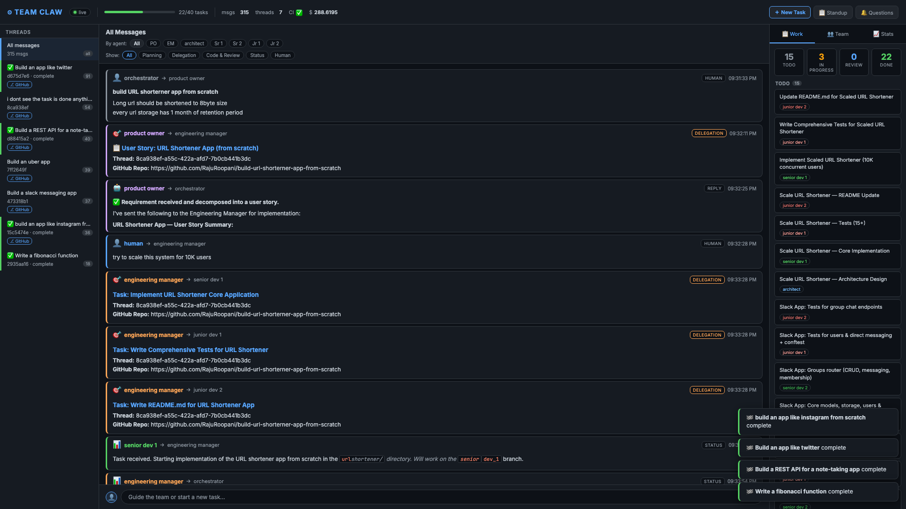

# Team Claw

An autonomous AI software development team running in Docker. Eight Claude agents — each playing a real SDLC role — receive requirements, design, implement, test, review, and ship working code to GitHub without human intervention.

Built across 11 phases, from a minimal 2-agent loop to a full team with a dedicated UX Engineer, CI, human-in-the-loop escalation, live dashboard, tool telemetry, and persistent agent memory that evolves with every task.



---

## The Team

| Container | Role | Model | Responsibilities |
|-----------|------|-------|-----------------|
| `product-owner` | Product Owner | claude-opus-4-6 | Refines requirements, defines acceptance criteria, signs off on delivery |
| `engineering-manager` | Engineering Manager | claude-opus-4-6 | Decomposes tasks, assigns work, tracks progress, unblocks team, triggers git push |
| `architect` | Architect | claude-sonnet-4-6 | Makes architecture/design decisions before implementation begins |
| `ux-engineer` | UX Engineer | claude-sonnet-4-6 | Produces wireframes, user flows, and component specs before UI implementation begins |
| `senior-dev-1` | Senior Dev 1 | claude-sonnet-4-6 | Implements features, reviews code, mentors Junior Dev 1 |
| `senior-dev-2` | Senior Dev 2 | claude-sonnet-4-6 | Implements features, reviews code, mentors Junior Dev 2 |
| `junior-dev-1` | Junior Dev 1 | claude-haiku-4-5 | Well-defined tasks, writes tests, asks Sr Dev 1 when blocked |
| `junior-dev-2` | Junior Dev 2 | claude-haiku-4-5 | Well-defined tasks, writes tests, asks Sr Dev 2 when blocked |

---

## Architecture

```
Human (CLI / Dashboard)
        │
        ▼
Orchestrator API (:8080)           FastAPI — task router, audit logger, SSE broadcaster
        │
        ├──→ Redis Streams          agent:{role}:inbox per agent + team:audit
        │
        ├── product_owner           Refines requirements → Engineering Manager
        ├── engineering_manager     Breaks down tasks → assigns to devs + architect + UX
        ├── architect               Reviews design → reports back to EM
        ├── ux_engineer             Wireframes + component specs → /workspace/designs/
        ├── senior_dev_1/2          Implements, commits, pushes → task_complete to EM
        └── junior_dev_1/2          Implements with mentor support → task_complete to EM
                │
                ▼
          /workspace                Shared Docker volume — all code written here
                │
                ▼
          sandbox (:8081)           Isolated test runner (no network, 512 MB RAM cap)
                │
                ▼
           PostgreSQL               Messages, threads, tasks, artifacts, CI results, tool telemetry
```

---

## Quick Start

### Prerequisites
- Docker + Docker Compose
- An Anthropic API key
- A GitHub token (for agents to push code)

### 1. Configure

```bash
cp .env.example .env
```

Edit `.env`:

```env
ANTHROPIC_API_KEY=sk-ant-...
GITHUB_TOKEN=ghp_...
GITHUB_USERNAME=your-github-username
```

### 2. Start the team

```bash
docker compose up --build
```

All 11 containers start: Redis, Postgres, Sandbox, Orchestrator, and 8 agent containers.

### 3. Install the CLI

```bash
pip install httpx
```

### 4. Submit a task

```bash
python3 cli.py submit \
  "Build a REST API for a todo app" \
  "Create a FastAPI service with CRUD endpoints for todos. Include pytest tests. GitHub Repo: build-a-todo-app"
```

### 5. Watch the team work

```bash
python3 cli.py watch <thread_id>
```

Or open the live dashboard at `http://localhost:8080`.

---

## CLI Reference

```
python3 cli.py <command> [options]
```

| Command | Description |
|---------|-------------|
| `submit "<title>" "<description>" [--priority high\|normal\|low]` | Submit a new task to the team |
| `watch <thread_id>` | Stream live messages for a thread (SSE) |
| `threads` | List all threads with status |
| `messages <thread_id>` | Print full message history for a thread |
| `standup [--hours N]` | Show what the team worked on in the last N hours (default: 24) |
| `budget <thread_id>` | Show token usage and budget bar for a thread |
| `tools [--agent role] [--thread id] [--limit N]` | Show tool execution history with stats |
| `questions [--thread <id>]` | List unanswered human questions (HITL) |
| `reply <thread_id> "<message>" [--to <agent_role>]` | Reply to a pending human question |

### Examples

```bash
# Submit a task
python3 cli.py submit "Build a Slack clone" "FastAPI with users, DMs, and group channels. GitHub Repo: my-slack-clone"

# Watch a thread live
python3 cli.py watch 550e8400-e29b-41d4-a716-446655440000

# See what the team built today
python3 cli.py standup --hours 8

# Check if agents have questions for you
python3 cli.py questions

# Reply to an agent's question
python3 cli.py reply 550e8400-e29b-41d4-a716-446655440000 "Use PostgreSQL, not SQLite" --to senior_dev_1

# Check token usage
python3 cli.py budget 550e8400-e29b-41d4-a716-446655440000
```

---

## Dashboard

Open `http://localhost:8080` for the live web dashboard:

- **Thread sidebar** — all threads with live status (active / waiting / complete)
- **Live activity indicator** — each thread card shows which agent last worked on it and how long ago (`⬤ engineering_manager · 3s ago`); dot pulses green when activity happened < 20 seconds ago; thread border turns green while an agent is actively processing
- **Thinking indicator** — a fading `⟳ role is thinking…` row appears at the bottom of the selected thread's feed between messages; disappears when the next real message arrives or after 12 seconds
- **Message feed** — real-time SSE stream of every inter-agent message
- **Context-aware chat bar** — submits a new task when no thread is selected; steers the active thread when one is selected (injects a human reply into the team's inbox)
- **Pending Questions panel** — shows unanswered `ask_human` questions; reply inline
- **CI results panel** — pass/fail per task with test counts
- **Kanban task board** — tasks per thread with status
- **Tool Activity panel** — last 8 tool calls with duration + top tools by call count
- **Budget bar** — token usage bar (green → amber → red) below the feed header
- **Agent heartbeat dots** — green/amber/gray per agent (30s heartbeat)
- **Standup modal** — one-click standup report
- **⚡ Status tab** — right panel tab showing the current thread's waiting state, which agents have unresolved delegations, and any pending human question (see below)

---

## Tools Available to Agents

| Tool | Description | Who has it |
|------|-------------|------------|
| `send_message` | Route a message to another agent via Redis | All |
| `read_file` | Read a file from /workspace | All |
| `write_file` | Write/overwrite a file in /workspace | All except PO |
| `edit_file` | Search-and-replace within a file | EM, Arch, UX, Sr, Jr |
| `list_files` | List files under a path in /workspace | All |
| `execute_code` | Run code in the sandbox (pytest, python, etc.) | EM, Sr, Jr |
| `search_code` | Grep for a pattern across /workspace | EM, Arch, UX, Sr, Jr |
| `find_files` | Glob pattern match across /workspace | EM, Arch, UX, Sr, Jr |
| `git_status` | Show git status of /workspace | EM, Sr, Jr |
| `git_commit` | Commit staged changes in /workspace | EM, Sr, Jr |
| `git_push` | Push a branch to GitHub | EM, Sr, Jr |
| `git_merge` | Merge a branch into another | EM |
| `git_diff` | Show unstaged/staged/commit-range diff | EM, Arch, Sr, Jr |
| `create_task` | Create a Kanban task (tracked in Postgres) | All |
| `update_task_status` | Update task status (todo/in_progress/done) | All |
| `wiki_write` | Write to the team wiki | EM, Arch, PO |
| `wiki_read` | Read from the team wiki | All |
| `write_memory` | Persist a key-value fact to agent memory (survives restarts) | All |
| `read_memory` | Recall a specific memory by key | All |
| `list_memories` | List all persisted memory keys for this agent | All |
| `check_budget` | Check token budget for current thread | All |
| `ask_human` | Pause thread and submit a question to the human | All |

---

## How a Task Works

```
1. Human submits task via CLI or Dashboard
        ↓
2. Orchestrator creates thread → routes to Product Owner
        ↓
3. Product Owner refines requirements → sends to Engineering Manager
        ↓
4. Engineering Manager decomposes into tasks → assigns to Architect + UX Engineer + Devs
        ↓
5. Architect reviews design decisions → reports back to EM
   UX Engineer produces wireframes + component specs → /workspace/designs/ → reports back to EM
        ↓
6. Senior/Junior Devs implement (using design doc as spec) → write tests → execute_code to verify
        ↓
7. Each Dev: git_status → git_commit → git_push → task_complete to EM
        ↓
8. EM receives all task_complete → git_merge feature branches → git_push main
        ↓
9. EM marks tasks done → CI runs in sandbox (pytest)
        ↓
10. CI passes → _auto_complete_thread() fires → thread status: complete
        ↓
11. Dashboard shows ✅ complete; GitHub repo has working code
```

If an agent is blocked or requirements are ambiguous, they call `ask_human` → thread enters `waiting` status → human replies via CLI or dashboard → thread resumes.

---

## Thread Lifecycle

```
submitted → active → (waiting) → active → complete
                         ↑
                  ask_human called;
                  human reply resumes
```

Threads can also be manually closed via the dashboard (🔒 button) or `POST /threads/{id}/close`.

---

## API Reference

### Tasks

| Method | Endpoint | Description |
|--------|----------|-------------|
| `POST` | `/task` | Submit a new task |
| `GET` | `/threads` | List all threads |
| `GET` | `/threads/{id}` | Get thread details |
| `GET` | `/threads/{id}/messages` | Get all messages in a thread |
| `GET` | `/threads/{id}/budget` | Get token usage for a thread |
| `GET` | `/threads/{id}/summary` | Get AI-generated thread summary |
| `POST` | `/threads/{id}/close` | Close a thread |

### Human-in-the-Loop

| Method | Endpoint | Description |
|--------|----------|-------------|
| `POST` | `/threads/{id}/human-reply` | Send a reply to an agent (resumes waiting thread) |
| `POST` | `/threads/{id}/ask-human` | (Agent-facing) Submit a question to the human |
| `GET` | `/pending-questions` | List all unanswered human questions |
| `GET` | `/threads/{id}/pending-questions` | List unanswered questions for a thread |

### Kanban

| Method | Endpoint | Description |
|--------|----------|-------------|
| `POST` | `/tasks` | Create a task |
| `PATCH` | `/tasks/{id}` | Update task status |
| `GET` | `/tasks` | List tasks (filter: `?thread_id=`) |

### CI

| Method | Endpoint | Description |
|--------|----------|-------------|
| `GET` | `/ci-results` | List CI results (filter: `?thread_id=&task_id=`) |
| `GET` | `/ci-results/trend` | Trend data for CI pass/fail over time |

### Telemetry

| Method | Endpoint | Description |
|--------|----------|-------------|
| `POST` | `/tool-executions` | Record a tool call (agent-facing) |
| `GET` | `/tool-history` | Query tool call history (filter: agent, tool, thread) |
| `GET` | `/tool-history/stats` | Aggregate stats + p95 latency per tool |
| `POST` | `/heartbeat/{role}` | Agent heartbeat (every 30s) |
| `GET` | `/agents` | Agent online/stale/offline status |

### Reports

| Method | Endpoint | Description |
|--------|----------|-------------|
| `GET` | `/standup` | Standup report (`?hours=24`) |
| `POST` | `/standup/publish` | Write standup to team wiki |
| `GET` | `/events` | SSE stream of all real-time events |

---

## Database Schema

| Table | Purpose |
|-------|---------|
| `threads` | Task threads with status, title, GitHub repo |
| `messages` | All inter-agent messages (full content + metadata) |
| `tasks` | Kanban tasks (todo / in_progress / done) |
| `artifacts` | Files written by agents (path + content) |
| `ci_results` | Sandbox test run results per task |
| `wiki` | Team wiki (key-value, updated by agents) |
| `agent_heartbeats` | Last ping per agent role |
| `tool_executions` | Every tool call: agent, tool, duration_ms, success |
| `human_questions` | HITL questions from agents, with answers |

---

## Project Structure

```
team-claw/
├── docker-compose.yml
├── .env.example
├── cli.py                              # Human CLI (submit, watch, standup, etc.)
│
├── orchestrator/
│   ├── Dockerfile
│   ├── requirements.txt
│   ├── main.py                         # FastAPI app — all endpoints, SSE, webhooks
│   └── dashboard.html                  # Live web dashboard (served at /)
│
├── agents/
│   ├── base/                           # Shared runtime for all agents
│   │   ├── Dockerfile
│   │   ├── requirements.txt
│   │   ├── agent.py                    # Core agentic loop (Claude API + tool dispatch)
│   │   ├── message_bus.py              # Redis Streams wrapper
│   │   ├── models.py                   # Message dataclass + MessageType enum
│   │   ├── entrypoint.py              # Container entrypoint (reads role from env)
│   │   └── tools/
│   │       └── __init__.py             # All tool schemas + executors + dispatcher
│   │
│   ├── product_owner/
│   │   ├── system_prompt.md
│   │   └── config.py                   # Allowed tools + reachable roles
│   ├── engineering_manager/
│   │   ├── system_prompt.md
│   │   └── config.py
│   ├── architect/
│   │   ├── system_prompt.md
│   │   └── config.py
│   ├── ux_engineer/
│   │   ├── system_prompt.md
│   │   └── config.py
│   ├── senior_dev/
│   │   ├── system_prompt.md
│   │   └── config.py
│   └── junior_dev/
│       ├── system_prompt.md
│       └── config.py
│
├── sandbox/
│   ├── Dockerfile
│   ├── requirements.txt
│   └── main.py                         # Code execution API (:8081)
│
└── shared/
    ├── db/
    │   └── schema.sql                  # Postgres schema (auto-loaded at startup)
    └── workspace/
        └── .gitkeep                    # Code written by agents lives here
```

---

## Configuration

Copy `.env.example` to `.env` and set these variables:

```env
# Required
ANTHROPIC_API_KEY=sk-ant-...

# GitHub (for agents to push code)
GITHUB_TOKEN=ghp_...
GITHUB_USERNAME=your-github-username

# Database
DB_USER=teamclaw
DB_PASSWORD=teamclaw

# Optional
WEBHOOK_URL=                    # POST notifications on ci.pass/ci.fail/thread.complete
THREAD_BUDGET_TOKENS=0          # Token budget per thread (0 = unlimited)
IDLE_THREAD_MINUTES=0           # Alert on threads idle > N minutes (0 = disabled)

# Model overrides (defaults shown)
PO_MODEL=claude-opus-4-6
EM_MODEL=claude-opus-4-6
ARCH_MODEL=claude-sonnet-4-6
UX_MODEL=claude-sonnet-4-6
SR_MODEL=claude-sonnet-4-6
JR_MODEL=claude-haiku-4-5-20251001
```

---

## Webhooks

Set `WEBHOOK_URL` in `.env` to receive POST notifications:

| Event | Payload |
|-------|---------|
| `ci.pass` | `{thread_id, task_id, passed, total}` |
| `ci.fail` | `{thread_id, task_id, passed, total, output}` |
| `thread.complete` | `{thread_id}` |
| `thread.waiting` | `{thread_id, question}` |
| `thread.resumed` | `{thread_id, target_role}` |
| `thread.closed` | `{thread_id}` |
| `budget.warning` | `{thread_id, used, limit}` |
| `budget.exceeded` | `{thread_id, used, limit}` |

---

## Agent Learning & Memory

Every agent accumulates knowledge across tasks. At the end of each task, agents call `write_memory` to save what they learned. At the start of the next task, they call `list_memories` to recall it. Memories are stored in Postgres and injected into each agent's system prompt at container startup — so knowledge persists across restarts.

Each role has a structured key schema so memories stay queryable and meaningful:

| Role | Key pattern | What accumulates |
|------|-------------|-----------------|
| Product Owner | `requirement:pattern:*`, `scope:pitfall:*`, `ac:template:*` | Better user stories, recurring scope traps, reusable AC patterns |
| Engineering Manager | `delegation:pattern:*`, `team:performance:*`, `workflow:lesson:*` | Smarter task decomposition, team calibration, process improvements |
| Architect | `pattern:arch:*`, `decision:*`, `mistake:*` | Reusable design decisions, ADR muscle memory, rework avoidance |
| UX Engineer | `pattern:ux:*`, `component:*`, `constraint:*` | Reusable component specs, design patterns, tech constraints that shaped layout |
| Senior Dev | `pattern:code:*`, `lesson:debug:*`, `tech:choice:*` | Code patterns, debugging playbook, library decisions |
| Junior Dev | `learned:*`, `mistake:*`, `mentor:advice:*` | Lessons from mentor, mistakes not to repeat, new techniques |

You can inspect any agent's memory bank via the API:

```bash
curl http://localhost:8080/memory/senior_dev_1
curl http://localhost:8080/memory/ux_engineer/pattern:ux:empty-state
```

---

## Agentic Loop Resilience

If the Claude API returns `stop_reason: max_tokens` (response truncated mid-generation), the agent loop no longer silently dies. Instead:

- **If tool calls are present** in the partial response — they are executed and the loop continues normally.
- **If no tool calls were made** — the loop injects a continuation nudge telling the agent to use tools rather than writing long text responses, then makes another API call.

This prevents agents from consuming their inbox message and producing nothing when a task generates a large initial response.

---

## Live Activity Signals

The dashboard shows real-time agent activity even between messages, so you always know whether a task is running or hung.

**How it works:**

1. `POST /metrics` fires on every Claude API call inside the agentic loop (already existed for token tracking). It now also writes an ephemeral `agent_working` event to a separate Redis stream `team:activity` (never persisted to Postgres) and updates an in-memory `thread_last_activity` map.
2. `GET /stream/all` reads from both `team:audit` (messages) and `team:activity` (working signals) in a single `xread` call — both streams flow through the same SSE connection.
3. The dashboard filters `agent_working` events out of the message feed and uses them only for the sidebar and thinking indicator.

**What you see:**

| Signal | Where | Meaning |
|--------|-------|---------|
| Pulsing green dot + `role · Xs ago` | Thread card | An agent made a Claude API call in the last 20 seconds |
| Green left border on thread card | Thread sidebar | Agent is actively processing right now |
| `⟳ role is thinking…` | Bottom of feed | Same signal — visible in the feed view; fades after 12s |
| Dot turns gray, time grows | Thread card | Agent finished or is waiting — no recent API calls |

No changes to `agent.py` were needed — the existing metrics hook was sufficient.

---

## Status Tab

The **⚡ Status** tab in the right panel gives you a real-time answer to "what is the team waiting on right now?" without scrolling through the message feed.

**Thread Status section:**
- A pill badge (`Active` / `Waiting for you` / `Complete` / `Closed`) with an animated dot for active threads
- The last agent to make a Claude API call and how long ago (live-updated via `agent_working` SSE events and every 15 seconds for elapsed-time ticking)

**Human Input Needed section** (shown only when thread is paused):
- The agent's question and optional context, with a "↓ Reply in feed" button that switches back to the Work tab and focuses the reply textarea

**Waiting On section:**
- Computed by scanning all messages for the current thread:
  - `task_assignment` is pending until `task_complete` arrives from that agent
  - `question` is pending until `answer` arrives from that agent
- Each pending item shows: agent name (in their role color), type badge (`task` or `question`), who assigned them, elapsed time, and a one-line preview of what was delegated

**What it looks like in practice:**

```
⚡ Status

Thread Status
● Active
  engineering_manager · ⚡ active now

Waiting On
🎯 senior_dev_1   [task]   3m ago
   assigned by engineering_manager
   Implement the REST API endpoints...

❓ architect       [question]   8m ago
   assigned by engineering_manager
   Should we use PostgreSQL or SQLite...
```

---

## What's Been Built (Phase History)

| Phase | What was added |
|-------|----------------|
| 1 | Foundation: Redis + Postgres + base Dockerfile, 2-agent loop (EM ↔ Sr Dev) |
| 2 | Full 7-agent team, all roles, code execution sandbox, Junior Devs |
| 3 | Context summarization, git tools (`git_status`, `git_commit`, `git_push`, `git_merge`), live dashboard |
| 4 | Shared `/workspace` volume, wiki tools, agent memory, artifact tracking |
| 5 | Agent heartbeats, Kanban task board, auto-CI (pytest in sandbox) |
| 6 | CI quality gate (blocks `done` if CI failed), webhooks, thread auto-completion |
| 7 | `search_code`, `find_files`, `check_budget` tools; standup report; budget bar in dashboard |
| 8 | `edit_file` tool, tool telemetry (duration + success per call), thread close endpoint, idle thread alerts |
| 9 | Human-in-the-loop: `ask_human` tool, `human_questions` table, pending questions panel, `git_diff` tool, context-aware chat bar (new task vs. steer mode), `questions`/`reply` CLI commands |
| 10 | GitHub integration: `git_push`/`git_checkout_branch`/`git_merge` tools, auto-repo creation, branch strategy, ⎇ link in dashboard |
| 11 | UX Engineer agent; `max_tokens` resilience fix in the agentic loop; agent memory evolution (all agents reflect and write memories after every task) |
| 12 | Live activity signals: thread cards show last-active agent + pulsing dot; `⟳ thinking…` indicator in feed; `team:activity` ephemeral Redis stream; no agent changes needed |
| 13 | ⚡ Status tab: right panel tab with thread status pill, "Waiting On" section (unresolved `task_assignment`/`question` messages diffed against `task_complete`/`answer`), and Human Input Needed section |
| 14 | Bug fixes: thread sidebar title no longer overwritten by mid-task steering messages; `execute_code` tool no longer loops silently when called without `code` or `file_path` |

---

## Tips

**Including a GitHub repo in your task** ensures agents push code when done:
```
"... GitHub Repo: build-a-todo-app"
```

**Thread titles are permanent** — the sidebar title is set when the task is submitted and never overwritten, even when you send steering messages mid-task.

**Steering a running task** — select the thread in the dashboard and type in the chat bar, or:
```bash
python3 cli.py reply <thread_id> "Switch from SQLite to PostgreSQL"
```

**Checking for questions** — agents call `ask_human` when genuinely blocked:
```bash
python3 cli.py questions
python3 cli.py reply <thread_id> "Your answer here"
```

**Watching costs** — each agent reports token usage; budget bars turn amber at 80%, red at 100%.

**UI tasks get a design doc first** — for any user-facing feature, the UX Engineer writes a wireframe + component spec to `/workspace/designs/` before devs write a line of code:
```bash
python3 cli.py submit "Build a dashboard" "... GitHub Repo: my-dashboard"
# UX engineer writes /workspace/designs/dashboard-ux.md
# Devs read it as their spec
```

**Inspect what agents have learned** — memories accumulate across tasks and persist in Postgres:
```bash
curl http://localhost:8080/memory/engineering_manager   # all EM memories
curl http://localhost:8080/memory/senior_dev_1          # all Sr Dev 1 memories
```

---

Built by [RajuRoopani](https://github.com/RajuRoopani).
