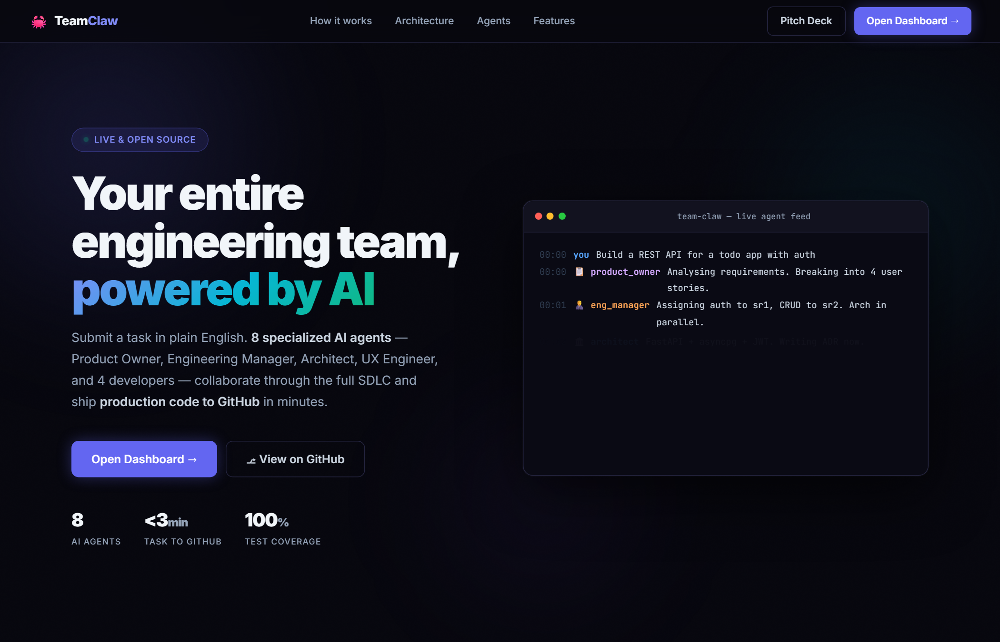
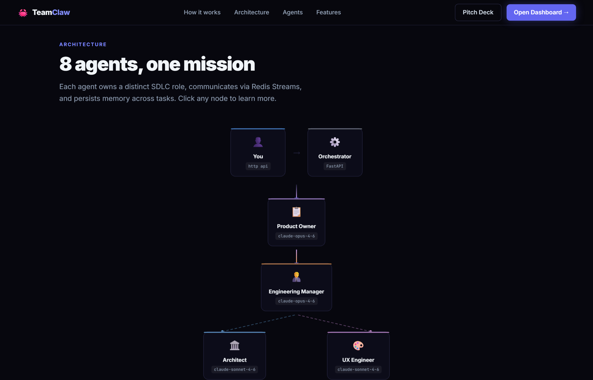
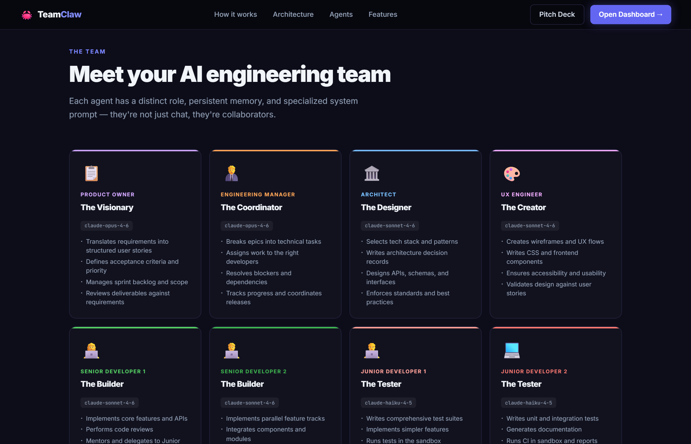
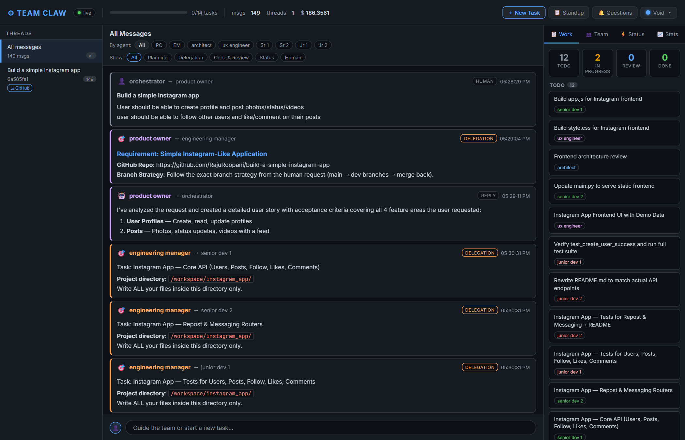

# Team Claw

> **An autonomous AI software development team.** Submit a requirement. Watch eight Claude agents design, build, test, and ship working code to GitHub — without touching a keyboard.

---

<div align="center">

**[Homepage](https://github.com/RajuRoopani/team-claw)** &nbsp;|&nbsp; **[Pitch Deck →  `/pitch`](https://github.com/RajuRoopani/team-claw)** &nbsp;|&nbsp; **[Live Dashboard →  `/dashboard`](https://github.com/RajuRoopani/team-claw)**

`8 agents` &nbsp;·&nbsp; `12 containers` &nbsp;·&nbsp; `25 tools` &nbsp;·&nbsp; `38 API endpoints` &nbsp;·&nbsp; `19 build phases` &nbsp;·&nbsp; `~5,000 LOC`

</div>

---

## Screenshots

<table>
<tr>
<td colspan="2">

### Homepage — Hero



</td>
</tr>
<tr>
<td>

### Interactive Architecture Diagram



</td>
<td>

### Agent Team Cards



</td>
</tr>
<tr>
<td colspan="2">

### Live Engineering Dashboard



</td>
</tr>
</table>

> **Three URLs ship with the system:**
> - `/` — Product homepage (this UI)
> - `/dashboard` — Live engineering feed, kanban, CI, agent heartbeats
> - `/pitch` — Investor pitch deck

---

## What It Does

You type one sentence. The team does the rest.

```
python3 cli.py submit \
  "Build a social media REST API" \
  "Users, posts, likes, follows, feed. FastAPI + tests. GitHub Repo: social-api"
```

Fifteen minutes later, a GitHub repo exists with production-ready code and a passing test suite — written, reviewed, and pushed entirely by AI agents talking to each other.

No scaffolding. No templates. No human in the loop (unless an agent asks).

---

## What's Been Shipped

Real apps, written autonomously, tests passing:

| App | Stack | Tests |
|-----|-------|-------|
| Facebook clone | Node.js + Express + SQLite | 61 / 61 ✅ |
| Twitter clone | FastAPI + PostgreSQL | 48 / 48 ✅ |
| Instagram clone | FastAPI + SQLite | 55 / 55 ✅ |
| Notes app | FastAPI + REST | 42 / 42 ✅ |

**206+ tests, all passing. All pushed to GitHub. Zero human code written.**

---

## The Team

Eight Claude instances, each playing a real engineering role:

| Agent | Model | What They Do |
|-------|-------|-------------|
| **Product Owner** | claude-opus-4-6 | Turns your requirement into a precise spec. Owns acceptance criteria. Signs off on delivery. |
| **Engineering Manager** | claude-opus-4-6 | Decomposes the spec into tasks. Assigns work. Unblocks the team. Enforces git push. |
| **Architect** | claude-sonnet-4-6 | Makes every design decision before a line of code is written. Writes ADRs. |
| **UX Engineer** | claude-sonnet-4-6 | Produces wireframes, user flows, and component specs. Devs read this as their UI spec. |
| **Senior Dev 1** | claude-sonnet-4-6 | Implements features. Reviews Junior Dev 1's work. Branches, commits, pushes. |
| **Senior Dev 2** | claude-sonnet-4-6 | Implements features. Reviews Junior Dev 2's work. Branches, commits, pushes. |
| **Junior Dev 1** | claude-haiku-4-5 | Handles well-scoped tasks. Escalates to Sr Dev 1 when blocked (max 3 round trips). |
| **Junior Dev 2** | claude-haiku-4-5 | Handles well-scoped tasks. Escalates to Sr Dev 2 when blocked (max 3 round trips). |

Each agent has its own Docker container, its own inbox (Redis Streams), and its own persistent memory bank (Postgres). They communicate by passing structured JSON messages — never through a shared file or a direct function call.

---

## How a Task Flows

```
You
 │  python3 cli.py submit "Build X" "Description..."
 ▼
Orchestrator (:8080)
 │  Creates thread → routes to Product Owner
 ▼
Product Owner
 │  Refines requirements → acceptance criteria → hands off to EM
 ▼
Engineering Manager
 │  Decomposes into tasks → assigns in parallel:
 ├──▶ Architect          Design decisions, ADRs, tech constraints
 ├──▶ UX Engineer        Wireframes + component specs → /workspace/designs/
 ├──▶ Senior Dev 1       Feature branch → implement → test → commit → push
 ├──▶ Senior Dev 2       Feature branch → implement → test → commit → push
 │    ├──▶ Junior Dev 1  Scoped sub-tasks under Sr Dev 1's mentorship
 │    └──▶ Junior Dev 2  Scoped sub-tasks under Sr Dev 2's mentorship
 ▼
Engineering Manager
 │  Receives task_complete from all agents → git merge → git push main
 ▼
Sandbox (:8081)
 │  pytest runs in isolated container (no network, 512 MB RAM cap)
 ▼
CI passes → thread auto-completes → GitHub repo has working, tested code
```

If an agent gets blocked, they call `ask_human` — the thread pauses, you see a notification in the dashboard, and the team resumes the moment you reply.

---

## Agents That Learn

Every agent accumulates knowledge across tasks. After each job, they call `write_memory` to store what they learned — patterns, mistakes, decisions. At the start of the next task, they recall it. Memories live in Postgres and survive container restarts.

| Agent | What They Remember |
|-------|--------------------|
| Product Owner | `requirement:pattern:*` — recurring scope traps, AC templates that worked |
| Engineering Manager | `delegation:pattern:*` — which decompositions hit blockers, team calibration |
| Architect | `pattern:arch:*`, `decision:*` — ADR muscle memory, what to avoid repeating |
| UX Engineer | `pattern:ux:*`, `component:*` — reusable UI patterns, layout constraints |
| Senior Dev | `pattern:code:*`, `lesson:debug:*` — debugging playbook, library choices |
| Junior Dev | `learned:*`, `mistake:*`, `mentor:advice:*` — growing from every task |

The longer the system runs, the more capable it becomes — without touching a prompt or redeploying.

```bash
curl http://localhost:8080/memory/senior_dev_1       # what Sr Dev 1 has learned
curl http://localhost:8080/memory/engineering_manager # EM's delegation patterns
```

---

## Any Role Can Be Added

The team is a plugin architecture. Adding a new specialist is two files and 8 lines of docker-compose:

```
agents/security_engineer/
├── system_prompt.md    ← Identity, responsibilities, workflow, output format
└── config.py           ← Which tools, which roles they can reach
```

```yaml
# docker-compose.yml — 8 lines
security-engineer:
  <<: *agent-base
  volumes:
    - ./agents/security_engineer:/agent
    - workspace:/workspace
  environment:
    ROLE: security_engineer
```

The new agent immediately inherits: Redis message bus, Postgres persistence, tool dispatcher, agentic loop with exponential backoff, max_tokens resilience, heartbeat, budget tracking, tool telemetry, memory system, and all 19 phases of production hardening.

**The UX Engineer was added this way — 160 lines total, shipped in one day.**

Next candidates: Security Engineer, QA Engineer, DevOps/SRE, Data Engineer, Tech Writer.

---

## Architecture

```
Human (CLI / Dashboard / API)
          │
          ▼
  Orchestrator (:8080)              FastAPI — 38 endpoints, SSE broadcaster, audit logger
          │                         Webhooks, HITL, CI gate, standup, tool telemetry
          │
     ┌────┴────┐
     │         │
  Redis      Postgres               Redis: Streams (durable inbox per agent) + Pub/Sub (real-time)
  Streams    (state)                Postgres: messages, threads, tasks, CI results, memory, wiki
     │
     ├── product_owner
     ├── engineering_manager
     ├── architect
     ├── ux_engineer
     ├── senior_dev_1/2
     └── junior_dev_1/2
               │
               ▼
         /workspace                 Shared Docker volume — all code written here
               │
               ▼
         Sandbox (:8081)            Isolated test runner — no network, 512 MB RAM cap
```

**12 Docker containers. One `docker compose up`.**

---

## Quick Start

### Prerequisites

| | macOS / Linux | Windows |
|--|---------------|---------|
| **Container runtime** | Docker Desktop or docker + docker-compose CLI | [Docker Desktop for Windows](https://www.docker.com/products/docker-desktop/) (WSL 2 backend) |
| **Python** (CLI only) | Python 3.9+ | Python 3.9+ from [python.org](https://www.python.org/downloads/) |
| **Git** | Any | [Git for Windows](https://git-scm.com/download/win) |
| **API keys** | Anthropic key + GitHub classic PAT | same |

> **Windows:** Clone with LF line endings (`.gitattributes` handles this automatically):
> ```powershell
> git clone -c core.autocrlf=false https://github.com/RajuRoopani/team-claw.git
> ```

### 1. Configure

```bash
cp .env.example .env   # then fill in your keys
```

Minimum required — **pick one AI provider:**

```env
# Option A — Anthropic API key
ANTHROPIC_API_KEY=sk-ant-...

# Option B — GitHub Copilot (no Anthropic key needed!)
# Leave ANTHROPIC_API_KEY unset; agents auto-detect your Copilot subscription.
GITHUB_TOKEN=ghp_...         # classic PAT with repo + workflow scopes
GITHUB_USERNAME=your-username
```

> **GitHub Copilot users:** set only `GITHUB_TOKEN` and `GITHUB_USERNAME`. The agents automatically route through `api.githubcopilot.com` using the same Claude models at no extra cost.

### 2. Start the team

```bash
docker compose up --build
```

Wait ~30 seconds for Postgres healthcheck. Then open `http://localhost:8080`.

### 3. Install CLI

```bash
pip install -r requirements.txt
```

### 4. Ship something

```bash
python3 cli.py submit \
  "Build a REST API for a todo app" \
  "FastAPI, CRUD endpoints, pytest tests. GitHub Repo: my-todo-api"
```

### 5. Watch it happen

```bash
python3 cli.py watch <thread_id>
# or open http://localhost:8080/dashboard
```

---

## Dashboard

`http://localhost:8080` — live web UI, no refresh needed.

| Feature | What it shows |
|---------|---------------|
| **Thread sidebar** | All threads with live status — active / waiting / complete / closed |
| **Live activity** | Which agent is working right now, how long ago, pulsing dot |
| **Thinking indicator** | `⟳ role is thinking…` appears between messages, fades when the next message arrives |
| **Message feed** | Full inter-agent conversation in real time (SSE) |
| **⚡ Status tab** | Who the team is waiting on, any pending human questions |
| **Pending questions** | `ask_human` questions from agents, reply inline |
| **CI panel** | Pass/fail + test counts per task |
| **Kanban board** | Task status per thread |
| **Tool Activity** | Last 8 tool calls with duration, top tools by call count |
| **Budget bar** | Token usage (green → amber → red) |
| **Agent heartbeats** | Online / stale / offline dot per agent (30s heartbeat) |
| **Standup modal** | One-click standup report for the last 24h |
| **7 themes** | Void, Ocean, Dracula, Nord, Cyberpunk, Forest, Solar |
| **Chat bar** | Submit new task (no thread selected) or steer active thread (thread selected) |

---

## CLI Reference

```bash
python3 cli.py submit "<title>" "<description>" [--priority high|normal|low]
python3 cli.py watch <thread_id>          # live SSE stream
python3 cli.py threads                    # list all threads
python3 cli.py messages <thread_id>       # full message history
python3 cli.py standup [--hours N]        # what the team did in last N hours
python3 cli.py budget <thread_id>         # token usage bar
python3 cli.py tools [--agent role] [--thread id] [--limit N]
python3 cli.py questions                  # pending ask_human questions
python3 cli.py reply <thread_id> "<answer>" [--to <role>]
```

---

## Production Features

19 phases of engineering baked in. Not bolted on.

| Feature | Detail |
|---------|--------|
| **Message durability** | Redis Streams with XAUTOCLAIM — no message lost on container restart |
| **Exponential backoff** | Rate-limit: 5/10/20s · Server error: 2/4/8s · Connection error: 3/6/12s |
| **Loop detection** | Circuit-breaks if same tool + same inputs repeats 3× |
| **max_tokens resilience** | Truncated responses trigger a continuation nudge instead of silent exit |
| **Exhaustion rescue** | If the loop ends without a natural stop, EM is notified automatically |
| **CI quality gate** | `status=done` blocked if the last pytest run failed (`?force=true` overrides) |
| **Thread close guard** | `POST /close` returns 409 if tasks are still incomplete |
| **Per-task git isolation** | Each project writes to `/workspace/{project}/` — zero cross-task contamination |
| **File ownership protocol** | EM assigns explicit file ownership — no agent overwrites another's work |
| **Budget tracking** | Token budget per thread; warnings at 80%, hard stop at 100% |
| **Idle detection** | Configurable alert when a thread goes quiet for N minutes |
| **Webhooks** | `ci.pass`, `ci.fail`, `thread.complete`, `thread.waiting`, `budget.warning` |

---

## Tools Available to Agents

25 tools. Each agent gets exactly the tools their role warrants.

| Tool | Who has it |
|------|-----------|
| `send_message` | All |
| `read_file`, `write_file`, `edit_file`, `list_files` | All (write/edit: not PO) |
| `search_code`, `find_files` | EM, Arch, UX, Sr, Jr |
| `execute_code` | Sr, Jr (not EM — prevents loop misuse) |
| `git_status`, `git_commit`, `git_push`, `git_diff` | EM, Arch, Sr, Jr |
| `git_checkout_branch`, `git_merge` | EM, Arch |
| `create_task`, `update_task_status` | All |
| `wiki_write`, `wiki_read` | EM, Arch, PO (write); All (read) |
| `write_memory`, `read_memory`, `list_memories` | All |
| `check_budget` | All |
| `ask_human` | All |

---

## API Reference

```
POST   /task                          Submit a task
GET    /threads                       List threads
GET    /threads/{id}/messages         Message history
GET    /threads/{id}/budget           Token usage
GET    /threads/{id}/summary          AI-generated summary
POST   /threads/{id}/close            Close thread (409 if tasks pending)
POST   /threads/{id}/human-reply      Answer an agent's question
GET    /pending-questions             All unanswered ask_human calls
POST   /tasks  ·  PATCH /tasks/{id}  Kanban
GET    /ci-results  ·  /ci-results/trend
GET    /tool-history  ·  /tool-history/stats   (p95 latency per tool)
GET    /agents                        Heartbeat status per agent
GET    /standup                       Standup report
GET    /events                        SSE stream
GET    /memory/{role}                 Agent memory bank
GET    /pitch                         Pitch deck
```

---

## Phase History

| Phase | What shipped |
|-------|-------------|
| 1 | Foundation: Redis + Postgres + base Dockerfile, 2-agent loop (EM ↔ Sr Dev) |
| 2 | Full 7-agent team, sandbox, Junior Devs |
| 3 | Context summarization, git tools, live dashboard |
| 4 | Shared `/workspace` volume, wiki, agent memory, artifact tracking |
| 5 | Heartbeats, Kanban, auto-CI (pytest in sandbox) |
| 6 | CI quality gate, webhooks, thread auto-completion |
| 7 | `search_code`, `find_files`, `check_budget`; standup report; budget bar |
| 8 | `edit_file`, tool telemetry, thread close, idle alerts |
| 9 | Human-in-the-loop: `ask_human`, pending questions panel, `git_diff`, context-aware chat bar |
| 10 | GitHub integration: auto-repo creation, branch strategy, ⎇ dashboard link |
| 11 | UX Engineer agent; `max_tokens` resilience; agent memory reflection after every task |
| 12 | Live activity signals: pulsing dot, `⟳ thinking…`, ephemeral activity stream |
| 13 | ⚡ Status tab: thread status, Waiting On section, Human Input Needed |
| 14 | Bug fixes: stable thread titles, `execute_code` silent-loop fix |
| 15 | 7 dashboard themes with localStorage persistence |
| 16 | Loop detection circuit-breaker; file ownership protocol; status noise reduction |
| 17 | Per-task isolated git repos — zero cross-task contamination |
| 18 | Message durability: XAUTOCLAIM on startup, pending-queue drain before blocking read |
| 19 | Resilience: exponential backoff, exhaustion rescue, thread close guard, push reminders, Architect git tools |

---

## Configuration

```env
# Required
ANTHROPIC_API_KEY=sk-ant-...
GITHUB_TOKEN=ghp_...            # classic PAT — fine-grained tokens return 403
GITHUB_USERNAME=your-username
DB_USER=teamclaw
DB_PASSWORD=teamclaw

# Optional
WEBHOOK_URL=                    # POST on ci.pass / ci.fail / thread.complete
THREAD_BUDGET_TOKENS=0          # 0 = unlimited
IDLE_THREAD_MINUTES=0           # 0 = disabled

# Model overrides
PO_MODEL=claude-opus-4-6
EM_MODEL=claude-opus-4-6
ARCH_MODEL=claude-sonnet-4-6
UX_MODEL=claude-sonnet-4-6
SR_MODEL=claude-sonnet-4-6
JR_MODEL=claude-haiku-4-5-20251001
```

---

## Tips

**UI tasks get a design doc first** — the UX Engineer writes wireframes to `/workspace/designs/` before devs write code:
```bash
python3 cli.py submit "Build a task dashboard" "... GitHub Repo: my-dashboard"
# → /workspace/designs/task-dashboard-ux.md exists before implementation begins
```

**Steer a running task** — select the thread in the dashboard and type, or:
```bash
python3 cli.py reply <thread_id> "Switch from SQLite to PostgreSQL"
```

**Flush stale inboxes** between tasks if agents seem stuck:
```bash
# macOS / Linux
for role in engineering_manager architect ux_engineer senior_dev_1 senior_dev_2 junior_dev_1 junior_dev_2 product_owner; do
  docker exec team-claw-redis-1 redis-cli XTRIM "agent:${role}:inbox" MAXLEN 0
done

# Windows (PowerShell)
foreach ($role in @("engineering_manager","architect","ux_engineer","senior_dev_1","senior_dev_2","junior_dev_1","junior_dev_2","product_owner")) {
  docker exec team-claw-redis-1 redis-cli XTRIM "agent:${role}:inbox" MAXLEN 0
}
```

**Check what agents have learned:**
```bash
curl http://localhost:8080/memory/senior_dev_1
curl http://localhost:8080/memory/architect
```

---

## Windows Troubleshooting

| Problem | Fix |
|---------|-----|
| `python3: command not found` | Use `python cli.py ...` or `Set-Alias python3 python` |
| Docker daemon not running | Start Docker Desktop, wait for the whale icon |
| Every file shows modified | Renormalize: `git rm --cached -r . && git reset --hard` |
| Port 8080 in use | `$env:ORCHESTRATOR_PORT=9090; docker compose up` |
| Containers exit immediately | Check `docker compose logs orchestrator` — usually missing `.env` |
| WSL 2 / Hyper-V errors | Docker Desktop → Settings → General → enable WSL 2 engine |

---

Built by [RajuRoopani](https://github.com/RajuRoopani).
